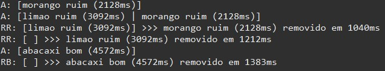
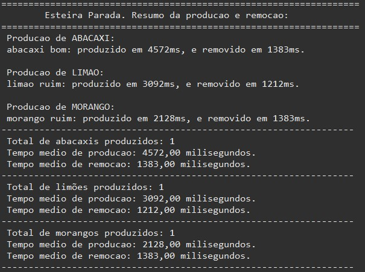

## Trabalho Prático - Esteira
 
O Trabalho Prático - Esteira, consiste no primeiro trabalho da disciplina de Laboratório de Sistemas Operacionais. Nele, foi criado um simulador de uma esteira mecânica com três entradas de produtos diferentes e duas saídas.
As três entradas consistem em três threads que adicionam produtos de qualidade "Bom" ou "Ruim" em um tempo aleatório. As duas saídas da esteira equivalem a duas threads, uma responsável por remover os produtos de qualidade "Bom" e outra por remover os de qualidade "Ruim". O tempo de remoção também é gerado de forma aleatória.

 <a href="#tecnologias">Tecnologias</a> •
 <a href="#serviços-usados">Serviços usados</a> • 
 <a href="#features">Features</a> • 
 <a href="#autora">Autora</a>

 
## Tecnologias 
  
* Java SE 15
 
## Serviços usados
 
* Github
* Eclipse IDE version 4.24.0

## Features
 
* Produção e inserção de N produtos na esteira
* Remoção dos N produtos da esteira separados por qualidade
* Visualização das mudanças realizadas na esteira, incluindo os seguintes prefixos:
  * "A:" para quando for adicionado um produto
  * "RB:" para quando um produto de qualidade "Bom" for removido
  * "RR:" para quando um produto de qualdiade "Ruim" for removido  

                                                                                                          
Exemplo da visualização das mudanças na esteira.

* Visualização da estatística final do simulador, incluindo:
  * Lista de produtos produzidos de cada tipo
  * Quantidade total de produtos produzidos de cada tipo
  * Média de tempo de inserção e remoção de cada tipo de produto

                                                                  
Exemplo da visualização da estatística final.  
 
## Autora
 
* **Gabrielle Bussolo**: @gabriellebussolo (https://github.com/gabriellebussolo)
